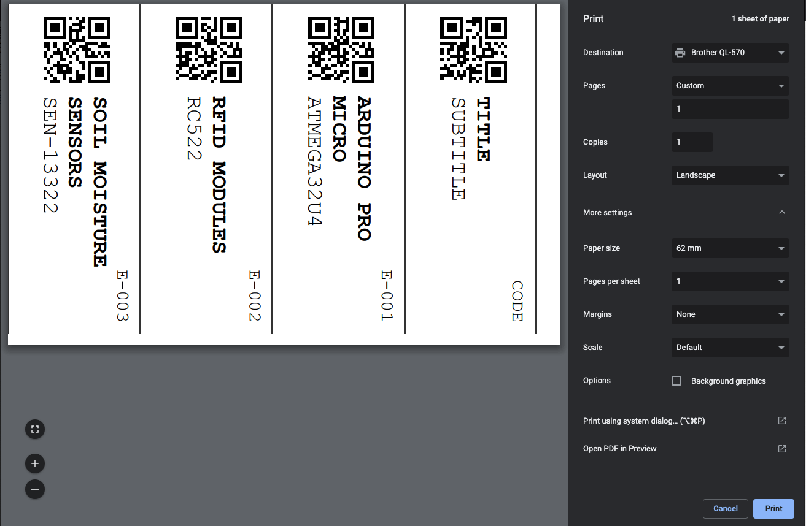

# QR Box Catalog

Organize your stuff with a QR box catalog. Print QR labels with your `Brother label printer` while keeping your box catalog inside a `Google spreadsheet`.

## Inspirational Quote

> "you can be organized if you really want to" Doc Braun

## Preparations

1. Navigate to the [following](https://docs.google.com/spreadsheets/d/1gsCyXlBS_brw7D663zLBJ4xPXU46R3Ks7xtujzJ1crI/) spreadsheet and `make a copy` of it in your own drive.
2. Click the `Share` button and make sure it is visible by link to anybody for viewing*. 
3. Copy the `spreadsheet id` from the URL and paste in in the `src/constants/config.json` file:
```json 
{
    "spreadsheetId": "1YZpgeHu4F7wI7WqQOLFHHnNa1x3H2jxTc0nuN8pR0q8"
}
```

Enter a valid [Google Sheet API](https://console.cloud.google.com/apis/credentials) key in `spreadsheet.js`:

```
const apiKey = 'YOUR_VALID_KEY';
```

> \* This will open it to the world. You can always turn off the sharing once you're done printing.

### Install dependencies
```bash
npm install
```
or 
```bash
yarn
```


## Run
```bash
npm start
```

Navigate to http://localhost:3000.


## Working with the spreadsheet
This spreadsheet is your catalogs DB. 
Each line represents a box/label. The only column you need to change are:
- Category
- Title
- Subtitle
  
The rest are auto-generated.
You print 4 labels each time and change the labels shown by changing the `starting line` to the correct value. 

> The starting line is saved in the `localStorage`.

### Adding categories
On the right side of the spreadsheet you'd see a legend where you can add categories. Those are just for reference. They do not effect the spreadsheet. When adding a new line/box note you only type in the initial letter, the count and box id are auto-generated.

## Printing
Press `⌘+p` to print and choose your `Brother Label Printer`.

Make sure to choose the following configuration:



That's it, happy cataloging!